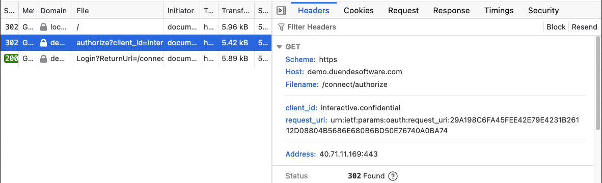

+++
title = 'Getting Started with PAR in ASP.NET 9 Previews'
date = 2024-08-06
draft = false
series = ['par']
+++
  
In my [previous post](), I shared my enthusiasm that I had contributed PAR support to ASP.NET, available in the upcoming 9.0 release. A deep dive on the extensibility points is still coming, but I thought first I should show a simple example of how to try out PAR today using nightly builds of the .NET SDK and OIDC nuget packages. The source for this example is [on github](https://github.com/josephdecock/ParInAspNetCore), but read on for a step-by-step breakdown.

<!--more-->

## Install a nightly build of the SDK

The first preview builds of the dotnet sdk that will include PAR support will be preview 7, which isn't released as of this writing. While you wait for preview 7, you can grab a nightly build of the SDK [here](https://github.com/dotnet/sdk/blob/main/documentation/package-table.md). Nightly builds of both rc1 and preview7 are available for many platforms. The PAR bits should be in both, but I installed 9.0.100-rc.1.24403.1.

## Create a new web project
We need a new project to host our PAR experiments:

```sh
dotnet new web -n ParInAspNetCore 
```

## Add the nightly build of the OIDC handler
The OIDC handler for ASP.NET Core is distributed in its own NuGet package. We need a nightly build of that package as well. The nightly builds are on a separate feed, so we need to [configure NuGet to use it](https://github.com/dotnet/sdk#for-net-9-builds). Create a nuget.config file in your project:

```xml
<configuration>
  <packageSources>
    <add key="dotnet9" value="https://pkgs.dev.azure.com/dnceng/public/_packaging/dotnet9/nuget/v3/index.json" />
  </packageSources>
</configuration>
```

And then install the nightly build of `Microsoft.AspNetCore.Authentication.OpenIdConnect`:
```sh
dotnet add package Microsoft.AspNetCore.Authentication.OpenIdConnect --prerelease
```

## Configure Authentication and Authorization
Next we need a basic OIDC configuration. First, add authentication and authorization services to DI:

```cs
builder.Services.AddAuthentication(opt =>
    {
        opt.DefaultScheme = "cookie";
        opt.DefaultChallengeScheme = "oidc";
    })
    .AddOpenIdConnect("oidc", opt =>
    {   
        opt.Authority = "https://demo.duendesoftware.com";
        opt.ClientId = "interactive.confidential";
        opt.ClientSecret = "secret";
        opt.ResponseType = "code";
        opt.DisableTelemetry = true;
    })
    .AddCookie("cookie");
builder.Services.AddAuthorization();
```

We're using demo.duendesoftware.com as our OIDC Provider, since [Duende.IdentityServer](https://docs.duendesoftware.com/identityserver/v7) supports PAR. Any OP that supports PAR will work here though. Notice that we don't need any special configuration for PAR, since support for it is declared by the OP in its discovery document. If you want to take a look, you can load the discovery document from https://demo.duendesoftware.com/.well-known/openid-configuration, and see the `pushed_authorization_request_endpoint` element in the resulting JSON. From this, the OpenId Connect handler infers that it should push authorization parameters by default.

With the services in DI, the last steps are to add the appropriate middleware to the pipeline:

```cs
var app = builder.Build();
app.UseAuthentication();
app.UseAuthorization();
```

And require authorization on the default endpoint so that it will issue a challenge when invoked:
```cs
app.MapGet("/", () => "Hello World!").RequireAuthorization();
```

## Run the Project and Observe PAR happening!
Now when we run the project and make a request to the root of the site, authorization will be required which will trigger an OIDC challenge. Without PAR, that would redirect the user to the authorize endpoint at the OP with all the authorize parameters in the Url. But with PAR, those parameters are sent in a server to server call first. Then in the browser, the user is redirected to the authorize endpoint with an opaque identifier instead of the other query parameters.

You can see below, our request to the authorize endpoint included only the client_id and request_uri:



It worked! The scope, response type, response mode, nonce, and pkce parameters are all hidden from view, and instead, we just pass the opaque request uri that the OP sent back to the handler when it pushed all those parameters.

See you next time for more discussion of how to extend the built-in PAR support!
